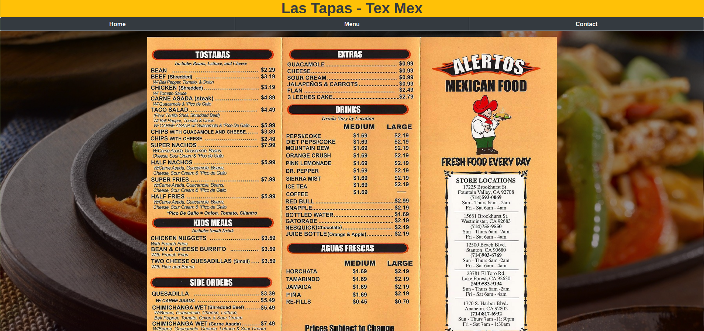

# Las Tapas - The Mexican Restaurant

This a project to learn webpack and create a simple static website for a restaurant.

One can

- Switch between different tabs(Home, Menu & Contact)
- Each tab displays a different information about the restaurant

## Las Tapas screenshot

## Built With

- JavaScript
- HTML
- CSS
- Bootstrap
- Webpack

## Getting Started

To set up a local copy of the project

- `git clone git@github.com:akshay-narkar/Las-Tapas_TexMex.git`
- `cd Library-App`
- `git pull origin feature`

If you want to repack the file

- Run `npm install` on the terminal to install dependancies
- Run `npx webpack` to bundle the files in the src folder & product ouput in dist folder
- Run `npm run start` to check live server

  or

- Go to the dist folder and open index.html

## Live Link of the project

[Netlify Live Link](https://gifted-wing-c25fcc.netlify.app/)

## Author

👤 **Akshay Narkar**

- Github: [@akshay-narkar](https://github.com/akshay-narkar)
- Twitter: [Akshay](https://www.twitter.com/akidoit)
- Linkedin: [Akshay Narkar](https://www.linkedin.com/in/akshaynarkar25/)

## 🤝 Contributing

Contributions, issues, and feature requests are welcome!

## Show your support

Give a ⭐️ if you like this project!

## Acknowledgments

- Thanks to Odin project for the tutorials.

## 📝 License

This project is [MIT](LICENSE) licensed.
